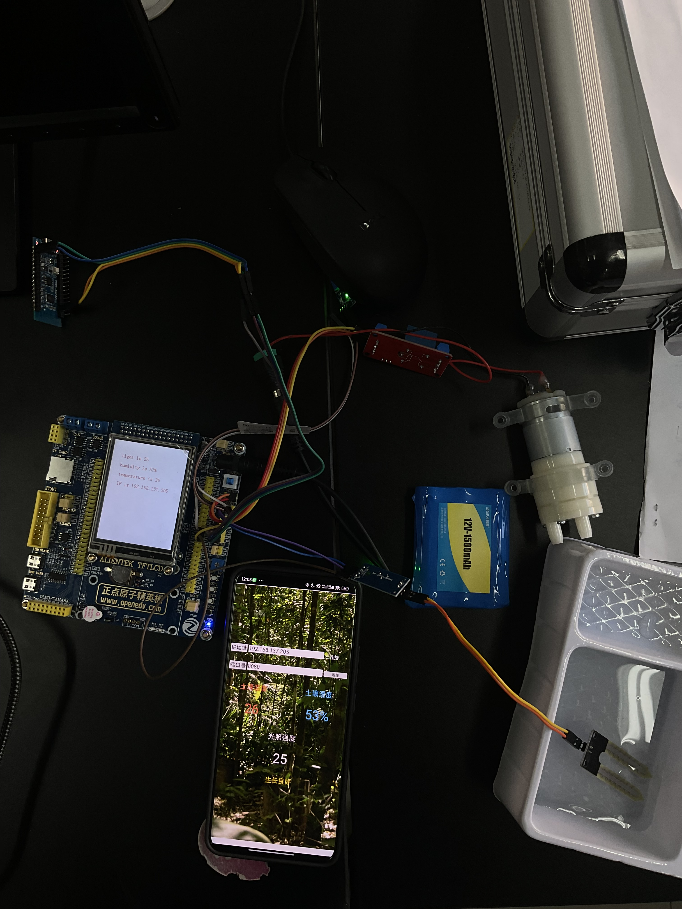
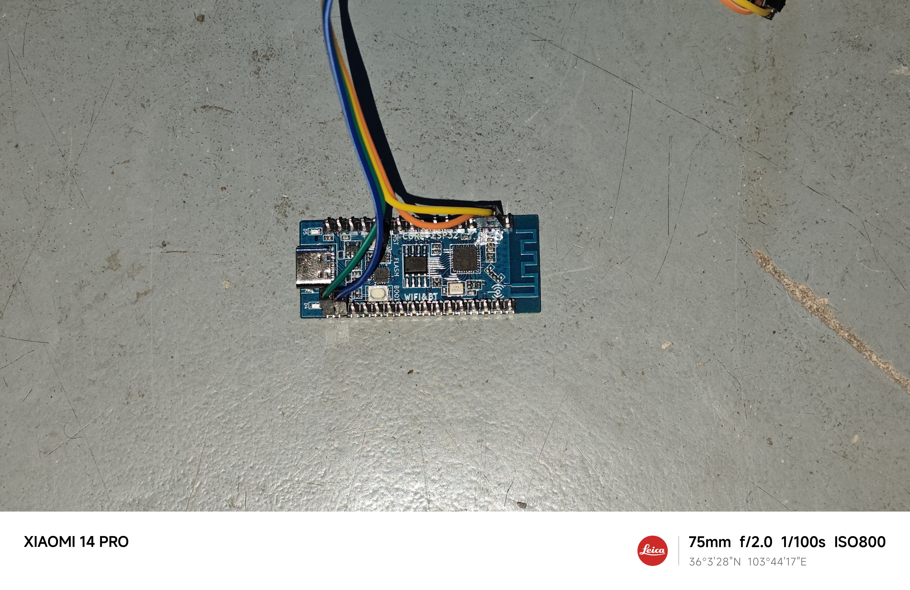
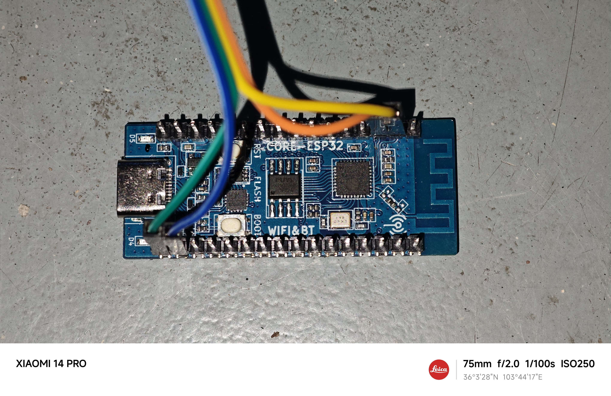
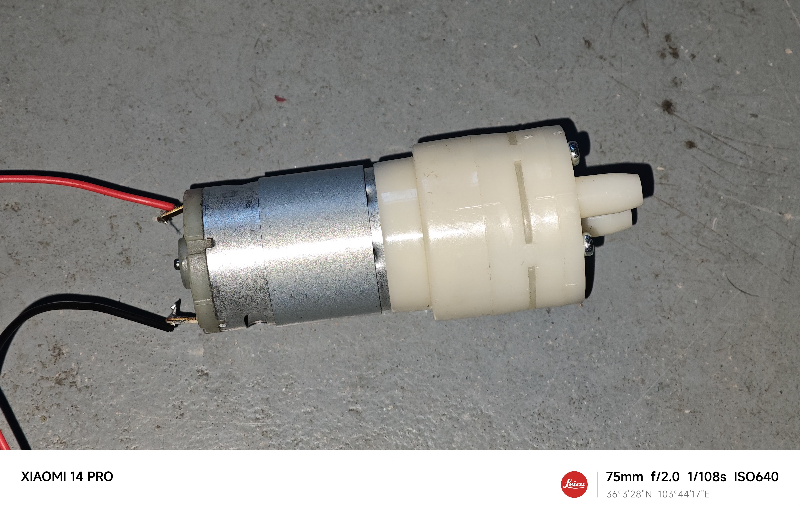
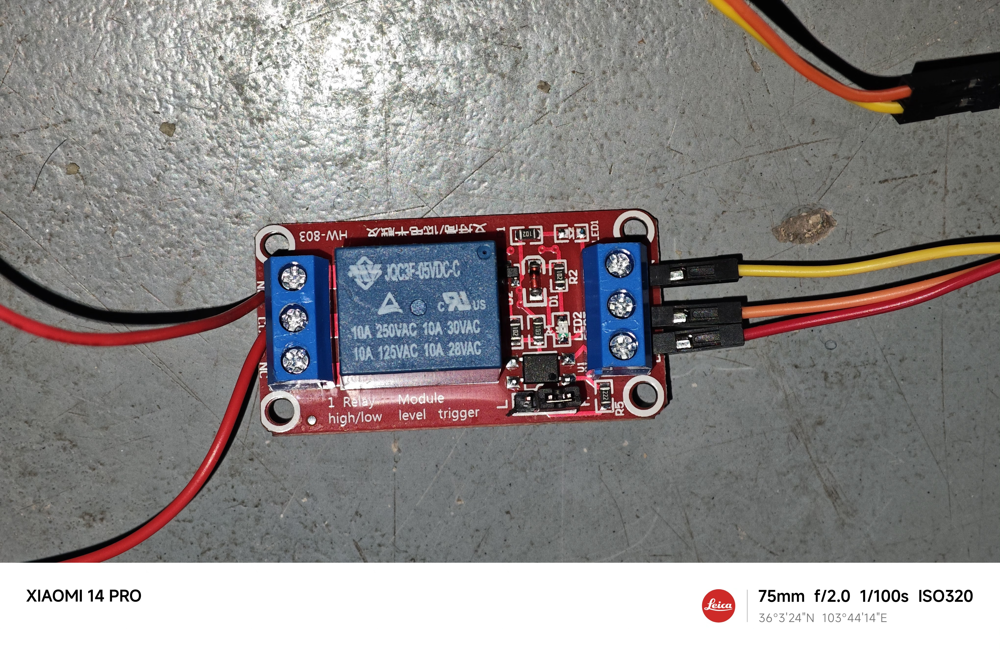
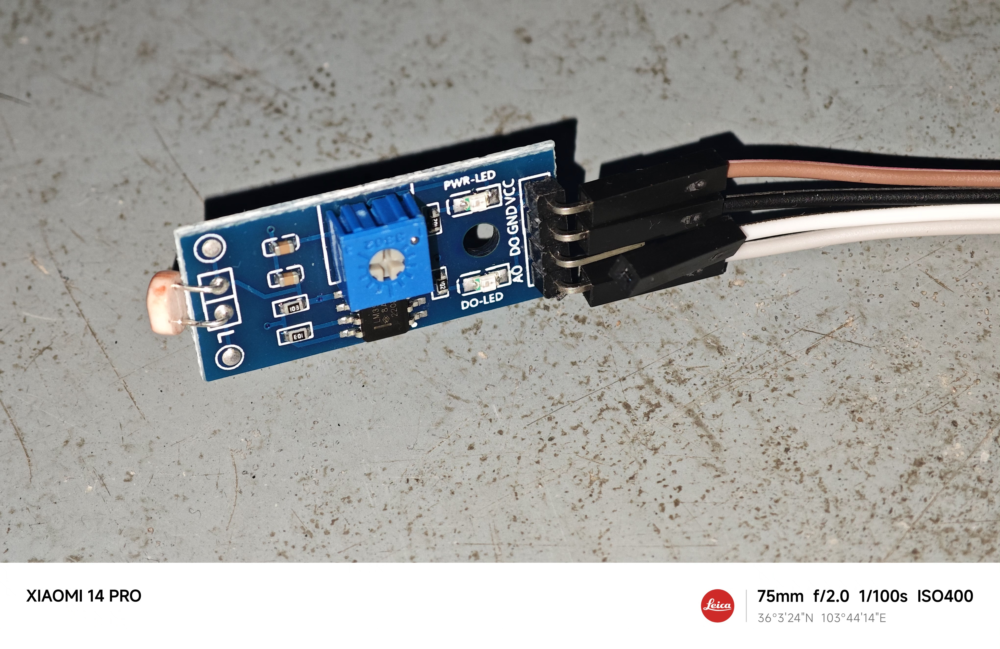
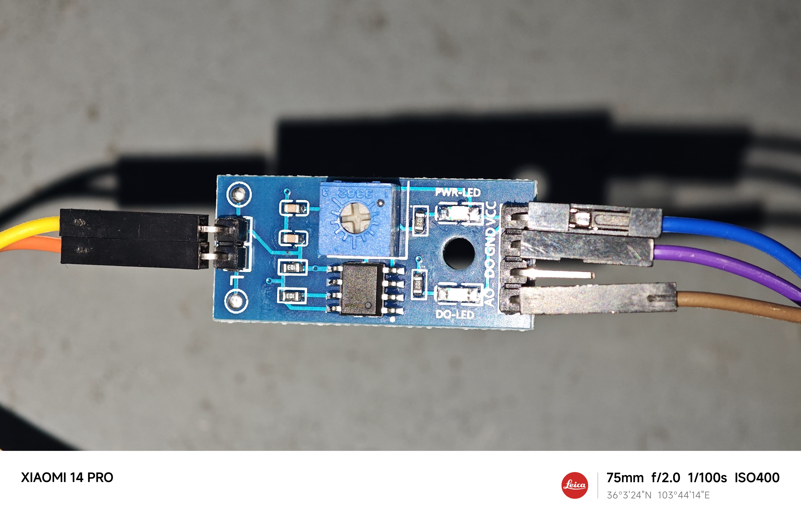
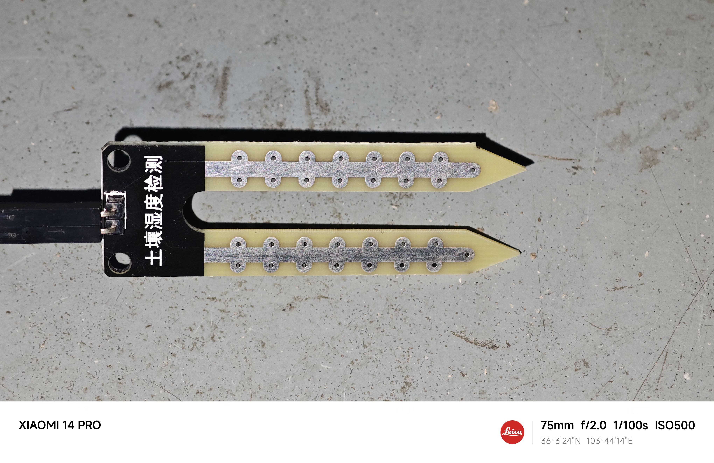
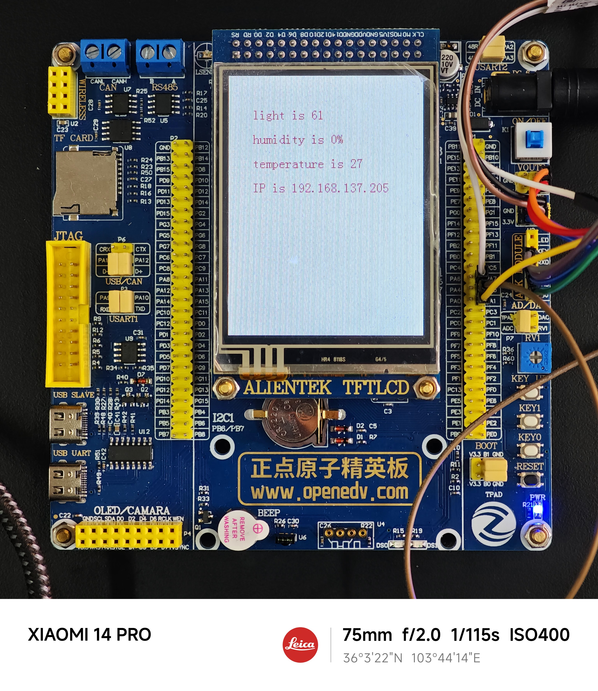

# 🌱 智能农业植物生长监测系统 (Smart Agriculture Plant Growth Monitoring System)

[](LICENSE)
[](#支持平台)
[](DOWNLOADS.md)

基于STM32F103ZET6的智能农业植物生长监测系统，集成温湿度传感器、光照传感器，通过ESP32模块实现无线数据传输，配备Qt桌面监控界面。

## 🚀 快速下载

**不想进入assets？直接下载所有文件！**

📥 **[点击进入直接下载中心 →](DOWNLOADS.md)**

包含所有源码、工程文件、文档的直接下载链接，无需进入assets文件夹。

## 📸 项目展示



<details>
<summary>更多项目图片</summary>
         









</details>

## 🎯 项目特性

- **实时监测**: 温度、湿度、光照强度实时监测
- **智能控制**: 自动灌溉系统，湿度低于5%时自动启动水泵
- **无线传输**: ESP32 WiFi模块实现数据无线传输
- **LCD显示**: 128x64 LCD实时显示监测数据
- **PC监控**: Qt桌面应用程序远程监控
- **数据记录**: TCP通信协议传输监测数据

## 🏗️ 系统架构

```
┌─────────────────┐    WiFi     ┌─────────────────┐    TCP     ┌─────────────────┐
│  STM32F103ZET6  │◄──────────►│    ESP32-C3     │◄─────────►  │     Qt App      │
│                 │             │                 │            │                 │
│ • 传感器数据采集  │             │ • WiFi AP模式    │           │• 实时数据显示    │
│ • LCD显示       │             │ • TCP服务器     │             │ • 历史数据记录   │
│ • 自动控制       │             │ • 数据转发       │            │ • 远程监控      │
└─────────────────┘             └─────────────────┘            └─────────────────┘
         │                               │
         ▼                               ▼
┌─────────────────┐             ┌─────────────────┐
│   传感器模块     │             │   网络通信       │
│                 │             │                 │
│ • 土壤湿度传感器  │             │ • WiFi连接      │
│ • 光照传感器     │             │ • 数据传输       │
│ • 温度传感器     │             │ • IP地址分配     │
└─────────────────┘             └─────────────────┘
```

## 📂 项目结构

```
plant_monitor/
├── STM32F103ZET6/           # STM32主控程序
│   └── plant_monitor/
│       ├── Core/            # 核心应用代码
│       ├── Drivers/         # HAL驱动库
│       └── MDK-ARM/         # Keil工程文件
│           └── serial2_ADC.uvprojx  # 主工程文件
├── ESP-IDF/                 # ESP32 WiFi模块程序
│   └── plant_monitor/
│       ├── main/            # 主应用程序
│       └── components/      # 组件库
├── Qt/                      # Qt桌面监控应用
│   └── plant_monitor/
│       ├── plant_monitor.ui # 界面设计文件
│       └── main.cpp         # 主程序入口
├── doc/                     # 项目文档
├── image/                   # 项目图片
└── README.md               # 项目说明文档
```

## 🚀 快速开始

### 硬件要求

- **主控**: STM32F103ZET6开发板
- **通信模块**: ESP32-C3开发板
- **显示**: 128x64 LCD显示屏
- **传感器**:
  - 土壤湿度传感器
  - 光照传感器 (光敏电阻)
  - 温度传感器 (内置ADC)
- **执行器**: 水泵继电器模块
- **电源**: 5V/12V电源适配器

### 软件要求

- **STM32开发**: Keil uVision 5
- **ESP32开发**: ESP-IDF 4.4+
- **桌面应用**: Qt 5.15+
- **仿真调试**: STM32CubeMX

## 🔧 编译和烧录

### 1. STM32F103ZET6程序编译

```bash
# 使用Keil uVision 5打开项目
# 文件路径: STM32F103ZET6/plant_monitor/MDK-ARM/serial2_ADC.uvprojx

# 1. 打开Keil uVision 5
# 2. File -> Open Project
# 3. 选择 serial2_ADC.uvprojx
# 4. Project -> Build Target (F7)
# 5. 使用ST-Link下载器烧录到STM32开发板
```

### 2. ESP32程序编译和烧录

```bash
# 进入ESP-IDF项目目录
cd ESP-IDF/plant_monitor

# 配置项目
idf.py menuconfig

# 编译项目
idf.py build

# 烧录到ESP32 (替换PORT为实际串口)
idf.py -p /dev/ttyUSB0 flash monitor
```

### 3. Qt桌面应用编译

```bash
# 进入Qt项目目录
cd Qt/plant_monitor

# 使用Qt Creator打开
# 或者使用命令行编译:
qmake plant_monitor.pro
make
```

## 📋 功能说明

### STM32主控功能

- **传感器数据采集**: 
  - ADC读取土壤湿度 (0-100%)
  - ADC读取光照强度 (0-100%)
  - 内置温度传感器读取温度值
- **LCD显示**: 实时显示监测数据和IP地址
- **自动控制**: 湿度低于5%时自动启动水泵
- **串口通信**: 与ESP32模块数据交换

### ESP32通信模块功能

- **WiFi AP模式**: 创建热点供设备连接
- **TCP服务器**: 监听端口等待客户端连接
- **数据转发**: STM32数据转发到PC端
- **IP地址广播**: 向STM32发送分配的IP地址

### Qt桌面应用功能

- **实时监控**: 显示温度、湿度、光照数据
- **TCP客户端**: 连接ESP32服务器接收数据
- **数据可视化**: 图表显示历史数据趋势
- **报警提示**: 异常数据报警提醒

## 🔌 引脚连接

### STM32F103ZET6引脚配置

| 功能 | 引脚 | 说明 |
|------|------|------|
| 湿度传感器 | PA0 (ADC1_CH0) | 模拟输入 |
| 光照传感器 | PA1 (ADC1_CH1) | 模拟输入 |
| 温度传感器 | PA2 (ADC1_CH2) | 内置温度传感器 |
| 水泵控制 | PA1 | 数字输出 |
| ESP32通信 | PA9/PA10 (UART1) | 串口通信 |
| 调试串口 | PB10/PB11 (UART3) | 调试输出 |
| LCD显示屏 | FSMC接口 | 并行接口 |

## 📊 数据协议

### STM32到ESP32数据格式
```
h<湿度值>~l<光照值>~t<温度值>~
例: h65~l78~t24.5~
```

### ESP32到PC数据格式
```
同STM32格式，TCP透传
```

## 🛠️ 开发环境配置

### Keil uVision 5配置

1. 安装STM32F1xx器件包
2. 配置下载器为ST-Link
3. 添加CMSIS和HAL库路径
4. 设置编译器优化级别

### ESP-IDF环境

```bash
# 安装ESP-IDF
git clone --recursive https://github.com/espressif/esp-idf.git
cd esp-idf
./install.sh
. ./export.sh

# 设置目标芯片
idf.py set-target esp32c3
```

### Qt开发环境

```bash
# Ubuntu/Debian
sudo apt-get install qt5-default qtcreator

# macOS
brew install qt@5

# Windows
# 下载Qt官方安装包
```

## 📈 性能指标

- **采样频率**: 10Hz
- **测量精度**: 
  - 温度: ±1°C
  - 湿度: ±2%
  - 光照: ±5%
- **通信延迟**: <100ms
- **电源功耗**: <2W
- **工作温度**: 0-50°C

## 🐛 故障排除

### 常见问题

1. **STM32无法下载程序**
   - 检查ST-Link连接
   - 确认BOOT0引脚状态
   - 重新安装驱动程序

2. **ESP32无法连接WiFi**
   - 检查WiFi配置
   - 确认天线连接
   - 查看串口输出信息

3. **Qt应用无法连接**
   - 确认ESP32 IP地址
   - 检查防火墙设置
   - 验证TCP端口状态

### 调试方法

```bash
# ESP32调试
idf.py monitor

# STM32调试
# 使用Keil调试器或串口输出

# Qt应用调试
# 使用Qt Creator调试器
```

## 📦 版本发布

查看详细的版本发布信息和下载说明：

- 📋 [**版本发布说明**](releases/README.md)
- 🎯 [**v1.0.0 详细说明**](releases/v1.0.0.md)  
- 📥 [**直接下载中心**](DOWNLOADS.md)

## 📜 许可证声明

**重要声明**: 本项目由 [https://github.com/glasswarm](https://github.com/glasswarm) (琉璃) 完全打造开发。

本软件使用自定义许可证，使用前必须获得 [https://github.com/glasswarm](https://github.com/glasswarm) (琉璃) 的明确同意。

**使用条件**:
- 任何商业或非商业使用前，必须联系并获得原作者 glasswarm (琉璃) 的书面许可
- 禁止未经授权的修改、分发或商业化使用
- 保留所有版权声明和作者信息

如需使用本项目，请联系: [https://github.com/glasswarm](https://github.com/glasswarm)

## 👨‍💻 作者信息

**原创作者**: [glasswarm (琉璃)](https://github.com/glasswarm)

- 项目设计与架构
- 硬件电路设计  
- 嵌入式软件开发
- 桌面应用程序开发

## 🤝 贡献指南

本项目当前为闭源项目，如需参与开发或提出建议，请联系原作者 [glasswarm](https://github.com/glasswarm)。

## 📞 技术支持

如有技术问题或使用咨询，请通过以下方式联系:

- GitHub Issues: [项目Issues页面]
- 原作者主页: [https://github.com/glasswarm](https://github.com/glasswarm)

## 🔄 版本历史

- **v1.0.0**: 初始版本发布
  - STM32传感器数据采集
  - ESP32 WiFi通信模块
  - Qt桌面监控应用
  - 基础自动控制功能

---

**© 2024 glasswarm (琉璃). All rights reserved.**
